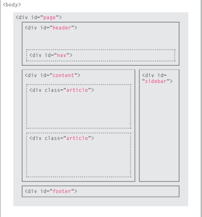

# Introduction to HTML
### Before we delve into how to build and design a website, we need to know how a user can access the website.
#### There are many ways to display it, but one of the most important ones
    1.Browsers: People access websites using software called a web browser, Popular examples include Firefox, Internet Explorer, Safari, Chrome, and Opera
    2.Web Servers: When you ask your browser for a web page, the request is sent across the Internet to a special computer known as a web server which hosts the website.
#### How is the website created?
##### If the site is simple and small, it does not need more than HTML and CSS, but if it is large then it needs more languages ​​to increase its efficiency and achieve the required functions of it such as: HTML, CSS, JavaScript, PHP...
# Structure
### There are many documents that require display on the website, and is specialized in HTML, in this part that they contain elements and tags that can be used in the code to obtain the required construction form.
```
<html>
<body>
 <h1>This is the Main Heading</h1>
 <p>This text might be an introduction to the rest of 
 the page. And if the page is a long one it might 
 be split up into several sub-headings.<p>
 <h2>This is a Sub-Heading</h2>
 <p>Many long articles have sub-headings so to help 
 you follow the structure of what is being written. 
 There may even be sub-sub-headings (or lower-level 
 headings).</p>
 <h2>Another Sub-Heading</h2>
 <p>Here you can see another sub-heading.</p>
</body>
</html>
``` 
# The Evolution of HTML
After its first release in 1993, many different versions were released, so its last version was HTML5, Where it contains some developments like:
*DOCTYPEs: Because there have been several versions of HTML, each web page should begin with a DOCTYPE declaration to tell a browser which version of HTML the page is using
*Comments in HTML: (<!-- -->) If you want to add a comment to your code that will not be visible in the user's browser, you can add the text between these characters
*ID Attribute: Every HTML element can carry the id attribute. It is used to uniquely identify that element from other elements on the page. Its value should start with a letter or an underscore.

# HTML5 layout elements

#### At the top of the page is the header, containing a logo and the primary navigation.
#### Under this are one or more articles or posts.
#### There is a side bar on the righthand side (perhaps featuring a search option, links to other recent articles, other sections of the site, or even ads).
#### When coding a site like this, developers would usually put these main sections of the page inside <div> elements and use the class or id attributes to indicate the purpose of that part of the page.

# Process & Design
#### Every website should be designed for the target audience
##### So there are some details that you should pay attention to, such as:
* Why People Visit YOUR Website?
* What Your Visitors are Trying to Achieve?
* What Information Your Visitors Need?

# JavaScript
### Introduction to JS
#### There are many additions that JavaScript has added to the website and make it more interactive, such as:
1. SLIDESHOWS
2. FORMS 
3. RELOAD PART OF PAGE
4. FILTERING DATA

## Before you start learning JavaScript and how to use it, there are three concepts you should know(ABD):
* What is a script and how do create one?
* I How do computers fit in with the world around them?
* How do I write a script for a web page?
