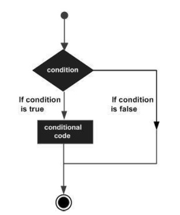
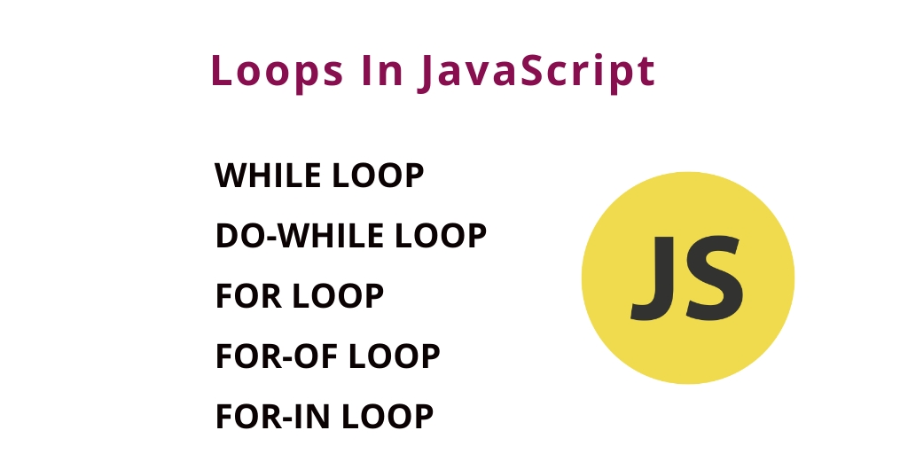

# Text
## Type of Text
1. Headings
2. paragraphs
## Text properties:
1. Bold
2. italic
3. emphasis

### Headings
```
<h1>This is a Main Heading</h1>
<h2>This is a Level 2 Heading</h2>
<h3>This is a Level 3 Heading</h3>
<h4>This is a Level 4 Heading</h4>
<h5>This is a Level 5 Heading</h5>
<h6>This is a Level 6 Heading</h6>
```
### Paragraphs
```
<p>Text is easier to understand when it is split up 
 into units of text. For example, a book may have 
 chapters. Chapters can have subheadings. Under 
 each heading there will be one or more 
 paragraphs.</p>
 ```

 ### Bold & Italic
 ```
 <p>This is how we make a word appear <b>bold.</b>
 </p>
 ```
 ```<p>This is how we make a word appear <i>italic</i>.
 </p>
 ```
 # CSS
 ##  Introduction to CSS
 #### CSS allows you to create rules that specify how the content of an element should appear.

 ### Some of the features that can be added to the site using CSS, to make it beautiful and coordinated:
 1. Block & InLine
 2. Font-Family
 3. Color
 ### Formula to use CSS:
 ```
 name of elements{
     Property: Value;
 }
 ```
# JavaScript instructions
## A script is a series of instructions that a computer can follow one-by-one. Each individual instruction or step is known as ***astatement***. Statements should end with ***asemicolon***. 
## You should write ***comments*** to explain what your code does. They help make your code easier to read and understand. This can help you and others who read your code.
## A script will have to temporarily store the bits of information it needs to do its job. It can store this data in ***variables***.
#### variables Declare:
```
var name of variable;
```
#### Assign value
```
 name of variable = value;
```
### Data Types of Variables:
1. NUMERIC Data Type
2. STRING Data Type 
3. BOOLEAN Data Type


# DECISIONS & LOOPS 
## DECISIONS

## LOOPS

