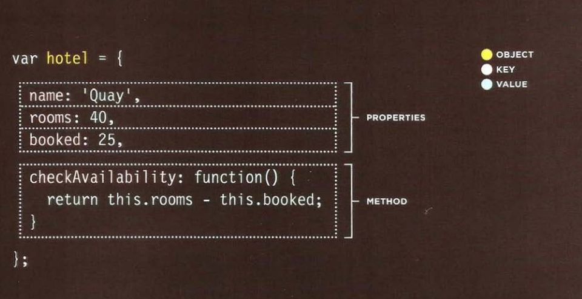
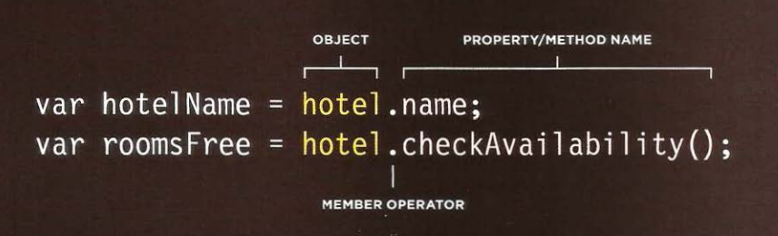
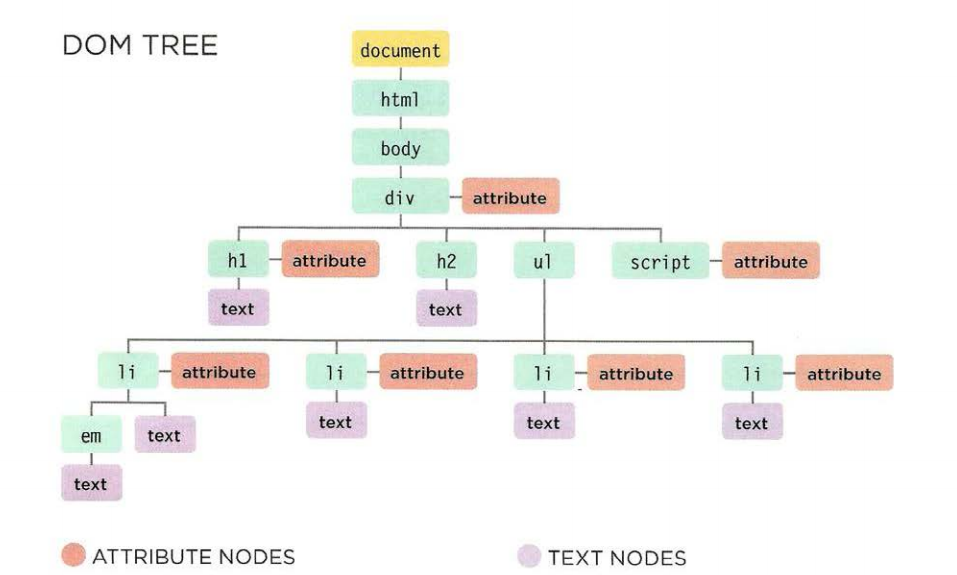

# JS

## WHAT IS AN OBJECT?
#### Objects group together a set of variables and functions to create a model of a something you would recognize from the real world. In an object, variables and functions take on new names. 

##### Property: a variable is part of an object, (key,VALUE)
##### Method: a function is part of an object.
### Creating an Object:

### Accessing an Object:

# Document Object Model(DOM)
### specifies how browsers should create a model of an HTML page and how JavaScript can access and update the contents of a web page while it is in the browser window.

#### DOM Tree

