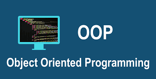

# Domain Modeling
### It is the creation of a model of the problem that explains its characteristics, behaviors, and limitations, and this work is called object orientation.
## You can create the model by Define a constructor and initialize properties

# Tables
### It is one of the ways to represent and display data.

## Basic Table Structure
* `<table>` element
* `<tr>` tag (opening table row)
* `<td>` tag (The td stands for table data.)
* `<th>` tag tato represent the heading for either a column or a row (The th stands for table heading)

# Functions, Methods, and Objects
## Create a constructor
### 