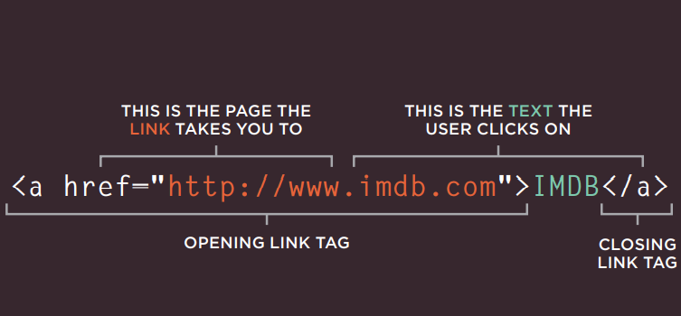

# HTML Links
## Links are created using the <a> element. Users can click on anything between the opening <a> tag and the closing </a> tag. You specify which page you want to link to using the href attribute.

### The components of the Link Tag:
 
 - The text between the opening `<a>` tag and closing `</a>` tag is known as link text
 - The value of the href attribute is the page that you want people to go to when they click on the link.

 ## Using Link:
 1. Linking to Other Pages on the Same Site
 2. Directory Structure
 3. Relative URLs

 # Layout
 - Block-level elements start on a new line Examples include: `<h1> 
 <ul> <li>`
 - Inline elements flow in between surrounding text Examples include: ` <b> <i>`

 ### Position of Elements
 - Normal Flow `position:static`
 - Relative Positioning `position:relative`
 - Absolute Positioning `position:absolute`
 - Fixed Positioning `position:fixed`

