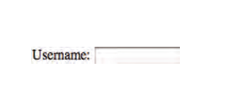
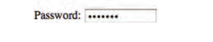
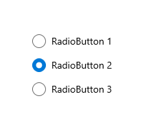
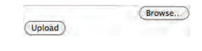
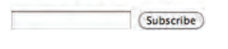
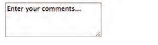
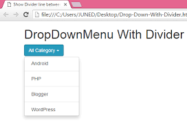

# Forms and JS Events
## Forms: HTML borrows the concept of a form to refer to different elements that allow you to collect information from visitors to your site.
### Types of form controls 
- ADDING TEXT:
    - Text input (single-line)
    - Password input
    - Text area (multi-line)
- Making Choices:
    - Radio buttons
    - Checkboxes
    - Drop-down boxes 
- Submitting Forms:
    - Submit buttons
    - Image buttons (Similar to submit buttons but they allow you to use an image.)
### How Forms Work
1. A user fills in a form and then presses a button to submit the information to the server.    
2. The name of each form control is sent to the server along with the value the user enters or selects.
3. The server processes the information.
4. The server creates a new page to send back to the browser based on the information received.

### Form Structure
* `<form>`
    * action
    * method
* `<input>` 
    * Text Input
        * type="text"
        * name
        * size
        * maxlength
    
    * Password Input
        * type="password"
        * name
        
    
    * Radio Button
        * type="radio"
        * name
        * value
        * checked 
        
    * Checkbox
        * type="checkbox"
        * name
        * value
        * checked
        
    * File Input Box
        * type="file"
        
    * Submit Button
        * type="submit"
        * name
        * value
        
    * Image Button
        * type="image"
        
* Text Area `<textarea>`
        * name
        * cols
        * rows
        * Between the open and closed tags is placed the text that appears to the user for the first time when filling the form
    
 * Drop Down List Box `<select>`
    * name
    * `<option>`
        * value
    * selected: The selected attribute can be used to indicate the option that should be selected when the page loads 
    - Multiple Select Box:
        - size
        - multiple
        - 

* Button & hidden Controls: 
    * `<button>`: This means that you can combine text and images between the opening `<button>`tag and closing `</button>` tag.
        * `<input> type="hidden"`
* `<label>` The `<label> `element can be used in two ways. It can:
    1. Wrap around both the text description and the form input (as shown on the first line of the example to your right).
    2. Be kept separate from the form control and use the forattribute to indicate which form control it is a label for (as shown with the radio buttons).
# Lists, Tables and Forms
* `list-style-type`
    * Unordered Lists For an unordered list you can use the following values:
    - none
    - disc
    - circle
    - square
    * Ordered Lists For an ordered (numbered) list you can use the following values:
    - decimal
    1 2 3
    - decimal-leading-zero
    01 02 03
    - lower-alpha
    a b c
    - upper-alpha
    A B C
    - lower-roman
    i. ii. iii.
    - upper-roman 
    I II III
* `list-style-image`: You can specify an image to act as a bullet point using the list-style-image property.    
* `list-style-position`: This property can take one of two values:
- outside The marker sits to the left of the block of text. (This is the default 
behaviour if this property is not used.)
- inside
The marker sits inside the box of text (which is indented).

## Table Properties
- width
- padding
- text-transform
- letter-spacing, font-size
- border-top, border-bottom 
- text-align
- background-color
- :hover
## Events
* DIFFERENT EVENT TYPES :
    * UI EVENTS
        * load
        * unload
        * error
        * resize
        * scroll
        
    * KEYBOARD EVENTS
        * keydown
        * keyup
        * keypress
    * MOUSE EVENTS 
        * click
        * dbl click
        * moused own
        * mouseup
        * mousemove
        * mouseover
        * mouseout
    * FOCUS EVENTS 
        * ocus / focus in 
        * blur / focusout 
    * FORM EVENTS 
        * input
        * change
        * submit
        * reset
        * cut
        * copy
        * paste
        * select