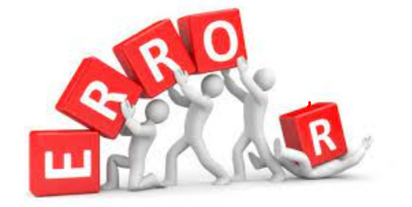

# Error Handling & Debugging

## To find the source of an error
- ORDER OF EXECUTION 
- EXECUT.ION CONTEXTS 
## EXECUTION CONTEXT & HOISTING 
### Each time a script enters a new execution context, there are two phases of activity: 
1. PREPARE:
- The new scope is created 
- Variables, functions, and arguments are created 
- Variables, functions, and arguments are created 
2. EXECUTE
- Now it can assign values to variables
- Reference functions and run their code
- Execute statements 

## Exception: a JavaScript statement generates an error, the interpreter stops and looks for exception-handl ing code. 
## The JavaScript console will tell you when there is a problem with a script, where to look for the problem, and what kind of issue it seems to be.
