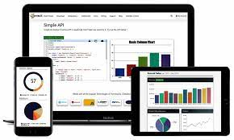

# Chart.js, Canvas


### Charts are far better for displaying data visually than tables and have the added benefit that no one is ever going to press-gang them into use as a layout tool. They’re easier to look at and convey data quickly, but they’re not always easy to create.
## Create a chart:
1. create a new html page and import the script: 
``````````
<!DOCTYPE html>
<html lang="en">
    <head>
        <meta charset="utf-8" />
        <title>Chart.js demo</title>
        <script src='Chart.min.js'></script>
    </head>
    <body>
    </body>
</html>
``````````
2. create a canvas element :
`````
<canvas id="buyers" width="600" height="400"></canvas>
`````
3. write a script
````
<script>
    //code
</script>
````
## Chart Types:
1. Line chart
2. Bar chart
3. Radar chart
4. Doughnut and Pie Charts
5. Polar Area Chart
6. Bubble Chart
7. Scatter Chart
8. Area Chart

## Data structures:
### In the JavaScript section, it includes an object from the constructor that is defined from the Chart library. It contains some properties such as:
- data property 
- labels property
``` 
data: [20, 10],
labels: ['a', 'b']
``` 

## Basic usage of canvas
### For Basic usage of canvas attributes
-   width and height, When no width and height attributes are specified, the canvas will initially be 300 pixels wide and 150 pixels high.
- styled (margin, border, background…)

