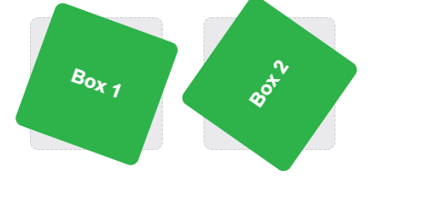
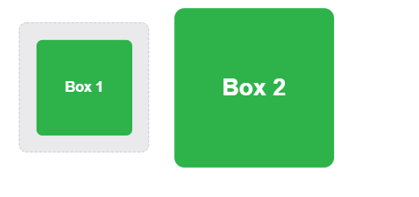

# CSS Transforms, Transitions, and Animations

## Transforms

###  New ways to position and alter elements, the actual syntax for the transform property is quite simple, including the transform property followed by the value. The value specifies the transform type followed by a specific amount inside parentheses.

```
div{
     transform: scale(1.5);
}
```
### 2D Transforms
#### 2D Rotate
```
.dviEl1{

    transform: rotate(20deg);
}
.dviEl2{

    transform: rotate(-30deg);
}
```


#### 2D Scale
```
.dviEl1{

    transform: scale(.5);
}
.dviEl2{

    transform:scale(1.7);
}
```


## Transitions As mentioned, for a transition to take place, an element must have a change in state, and different styles must be identified for each state.

```
.box {
  background: black;
  transition-property: background;
  transition-duration: 1s;
  transition-timing-function: linear;
}
.box:hover {
  background: whit;
}

```


## 8 really simple effects
1. Fade in
2. Change color
3. Grow & Shrink
4. Rotate elements
5. Square to circle
6. 3D shadow
7. Swing
8.  Inset border


