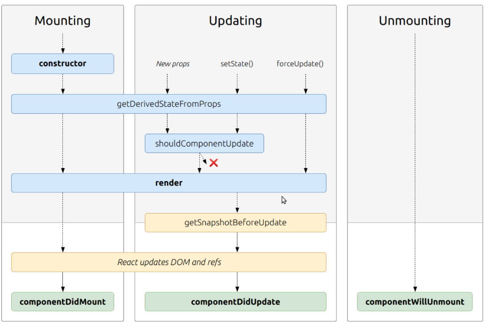

# State and Props
*  lifecycle events:  The methods that you are able to use on classes or functions.

## phases of the component lifecycle
1. Mounting
2. Updating
3. Unmounting
### Props: are arguments passed into React components, and children to this component as a single object.
### State: is similar to props, but it is private and fully controlled by the component.

