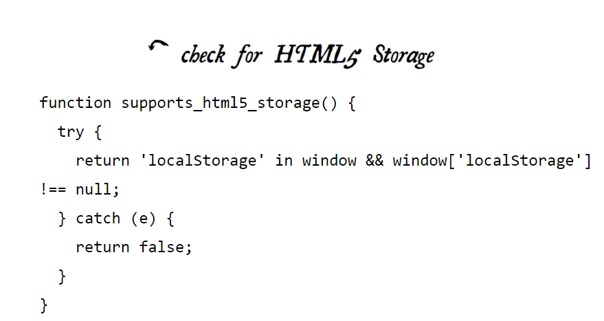

# Local Storage

### In the genesis of web applications they did not have the ability to store at first, compared to the native applications, and cookies were subsequently created to store data in limited quantities; And it had some disadvantages such as:
- Cookies are sent with every GTML, which affects the speed, as the same data is sent repeatedly.
- Send unencrypted data.
- Its size is limited.

## Local storage developments:
* userData: Invented by Microsoft, it enables the user to store data up to a maximum of 64 KB, and the user cannot increase it.
* Flash: Adobe developed Flash, allowing to store 100 KB, and later it was developed to allow an increase in size if the user requested it.
* Gears: In 2007, Google launched Gears, an open source browser plugin that aims to provide additional capabilities in browsers.
It can store unlimited amounts of data for every domain in SQL database tables.

### One of the downsides is that each of them has a different interface, which makes it difficult.

# HTML5 Storage
### It is a way for web pages to store data within a user's browser, and this data continues even after leaving the browser.
### Data can be accessed using JavaScript if the browser supports it.

## USING HTML5 STORAGE
Any type of data can be recovered as long as JavaScript supports it (booleans, integers, ...)