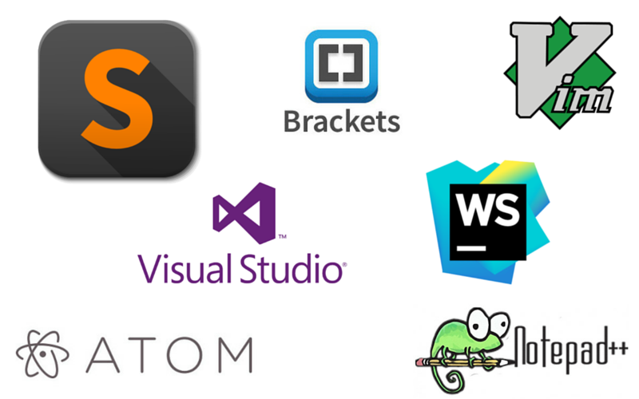

# Choosing A Text Editor 

#### There are tons of text editors out there, and everyone prefers a different one, but what is a text editor? How do you know the best and most appropriate? All this and more in this article.
## What is a text editor?
##### It is a program that you can download on your own computer, or browse on the Internet, that allows you to write the code and modify it, and it contains tools that make the process easier for you.
## Features of a good editor:
1. Code completion allows you to start typing.
2. Syntax highlighting
3. A nice variety of themes

## There are two types of text editors:
* ***Basi text editors:*** They are editors without any privileges, their use requires attention to all details without any warning if you override one of them, starting with choosing the file name, its extension, and where to store it, and ending with a parenthesis that you may have forgotten.It is downloaded automatically on your own device

* ***Improved text editors:*** They are editors with many privileges, that help in writing the code and increase the efficiency and accuracy of work. There are free and paid ones, you can get it from the websites of their manufacturers, such as: Visual Studio Code, NotePad++...

